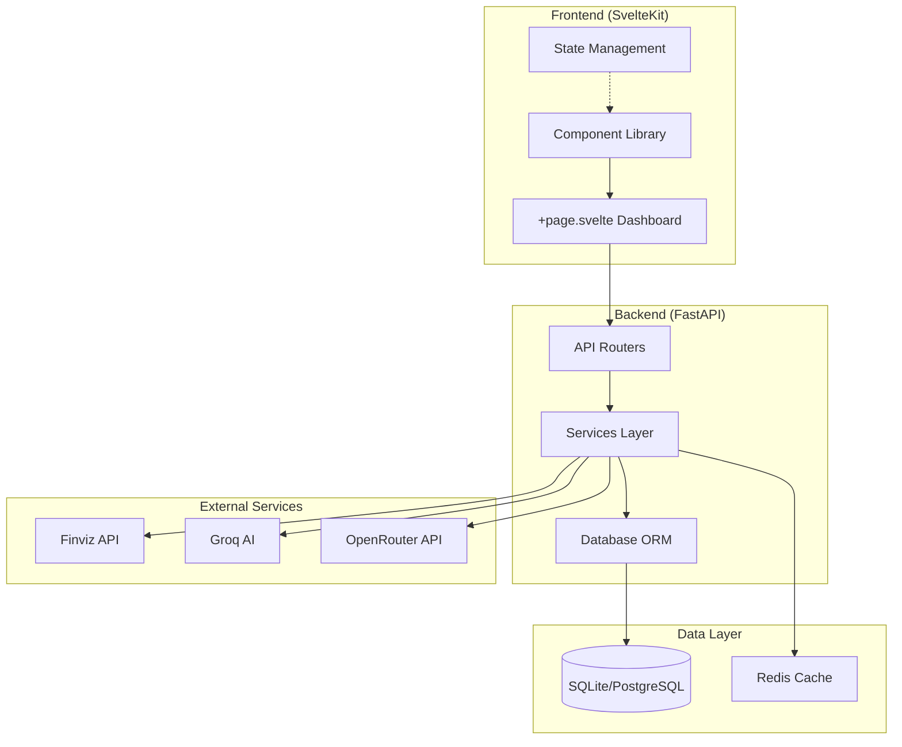
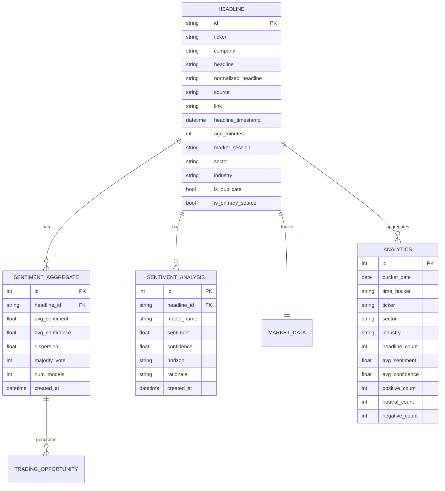
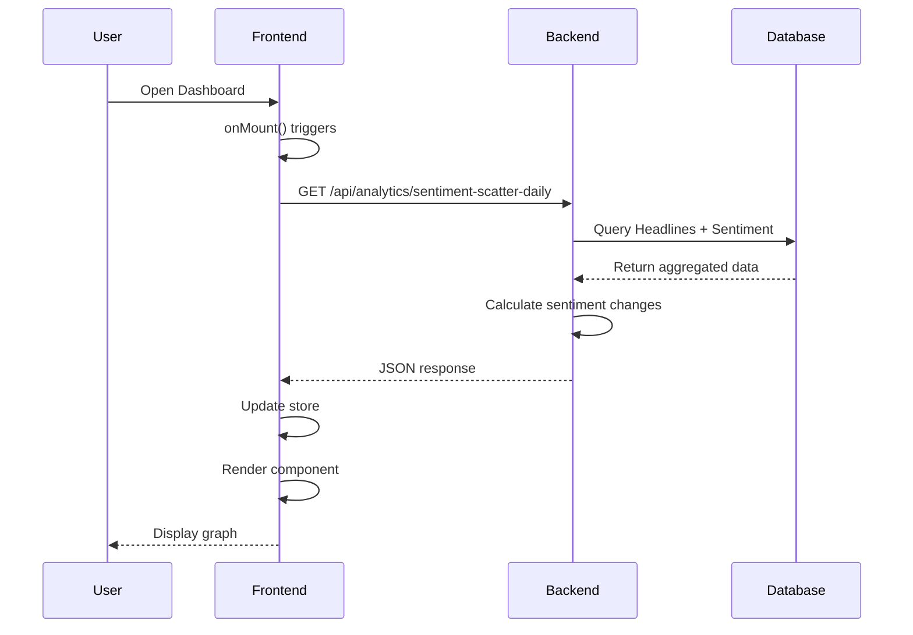
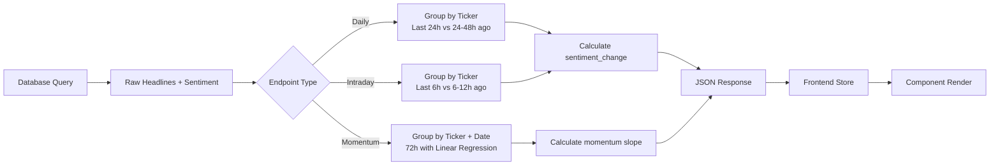
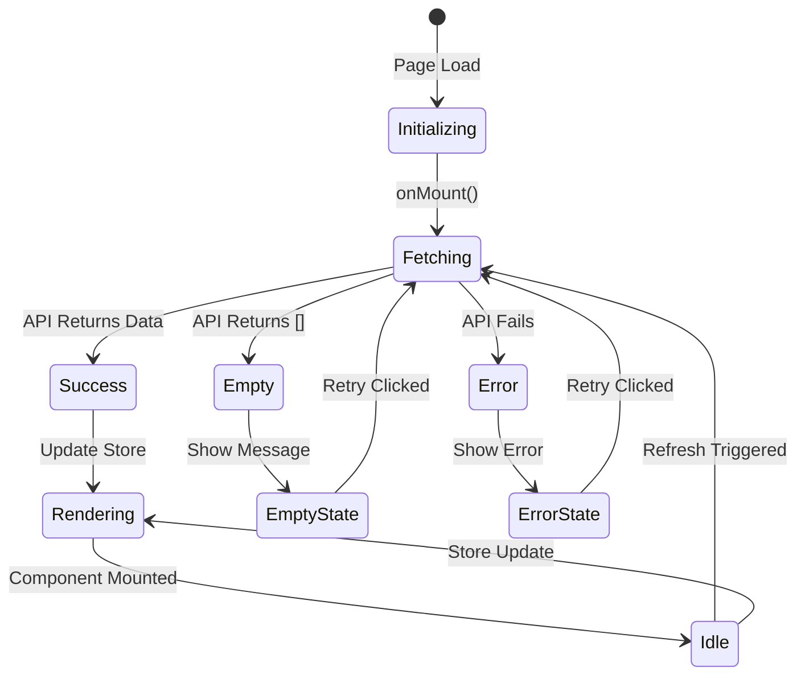

# brākTrād Architecture Documentation

## System Overview

brākTrād is a real-time financial sentiment analysis platform that aggregates news headlines, performs multi-model sentiment analysis, and generates trading opportunities.

## Architecture Diagram



## Database Schema

### Core Tables



### Graph Data Dependencies

```mermaid
graph LR
    A[Headline Table] -->|headline_id| B[SentimentAggregate Table]
    B --> C{Aggregation Type}
    C -->|Daily| D[24h Buckets]
    C -->|Intraday| E[6h Buckets]
    C -->|Momentum| F[72h with Linear Regression]
    
    D --> G[/sentiment-scatter-daily]
    E --> H[/sentiment-scatter-intraday]
    F --> I[/sentiment-scatter-momentum]
```

## API Architecture

### Router Structure

```
backend/routers/
├── analytics.py          # Analytics & chart data endpoints
│   ├── GET /summary
│   ├── GET /trends
│   ├── GET /word-cloud
│   ├── GET /top-movers
│   ├── GET /sentiment-scatter-daily      [NEW]
│   ├── GET /sentiment-scatter-intraday   [NEW]
│   └── GET /sentiment-scatter-momentum   [NEW]
├── sentiment.py         # Sentiment analysis endpoints
├── headlines.py         # Headline management
├── opportunities.py     # Trading opportunities
├── portfolio.py         # Portfolio management
├── returns.py           # Returns analysis
├── settings.py          # User settings
└── database.py          # Database utilities
```

### Request Flow



## Graph Data Pipeline

### Component Hierarchy

```
+page.svelte (Dashboard)
├── loadDashboardData()
│   ├── analytics.fetchSummary()
│   ├── analytics.fetchTrends()
│   ├── analytics.fetchTopMovers()
│   ├── analytics.fetchWordCloud()
│   ├── analytics.fetchScatterDaily()      [NEW]
│   ├── analytics.fetchScatterIntraday()   [NEW]
│   └── analytics.fetchScatterMomentum()   [NEW]
│
└── Graph Components
    ├── SentimentChart.svelte           (Trends)
    ├── SentimentScatterplot.svelte     (Daily Change)
    ├── D3SentimentScatterplot.svelte   (Intraday)
    ├── SvgSentimentScatterplot.svelte  (Momentum)
    └── WordCloud.svelte                (Terms)
```

### Data Transformation Pipeline



### State Management Flow



## Performance Architecture

### Caching Strategy

Currently no caching implemented. Recommended additions:

```python
# Redis cache structure (future enhancement)
cache_keys = {
    'scatter:daily:{hours}:{limit}': {'ttl': 300},  # 5 minutes
    'scatter:intraday:{limit}': {'ttl': 300},       # 5 minutes
    'scatter:momentum:{limit}': {'ttl': 600},       # 10 minutes
}
```

### Query Optimization

Current implementation uses optimized SQL:

```sql
-- Example: Daily scatter data
SELECT 
    h.ticker,
    h.company,
    AVG(s.avg_sentiment) as current_sentiment,
    COUNT(h.id) as headline_count
FROM headline h
JOIN sentiment_aggregate s ON h.id = s.headline_id
WHERE h.headline_timestamp >= :cutoff
  AND h.is_duplicate = 0
GROUP BY h.ticker, h.company
ORDER BY current_sentiment DESC
LIMIT :limit;
```

**Recommended Indexes:**
```sql
CREATE INDEX idx_headline_timestamp_ticker 
    ON headline(headline_timestamp, ticker);
    
CREATE INDEX idx_headline_duplicate 
    ON headline(is_duplicate);
    
CREATE INDEX idx_sentiment_headline_id 
    ON sentiment_aggregate(headline_id);
```

### Real-time Updates

WebSocket integration (future enhancement):

```python
# WebSocket events for scatter data updates
{
    "type": "scatter_update",
    "payload": {
        "type": "daily",
        "data": [...]
    }
}
```

## Security Architecture

### API Security

- **Rate Limiting:** Implemented via config settings
- **CORS:** Configured per environment
- **Input Validation:** Pydantic models for all endpoints
- **SQL Injection Prevention:** SQLAlchemy ORM parameterization

### Data Privacy

- No PII stored in database
- Headlines stored with attribution
- Sentiment scores anonymized per ticker
- Historical data retention policy: 90 days

## Deployment Architecture

### Development

```bash
# Local development stack
Frontend:  http://localhost:5173 (Vite dev server)
Backend:   http://localhost:8000 (Uvicorn)
Database:  SQLite (braktrad.db)
Cache:     Not implemented
```

### Production (Docker)

```yaml
services:
  frontend:
    build: ./frontend
    ports: ["80:80"]
    
  backend:
    build: ./backend
    ports: ["8000:8000"]
    environment:
      DATABASE_URL: postgresql://...
      REDIS_URL: redis://...
      
  postgres:
    image: postgres:15
    volumes: [./data:/var/lib/postgresql/data]
    
  redis:
    image: redis:7-alpine
```

## Monitoring & Observability

### Logging

```python
# Structured logging with structlog
logger.info("scatter_data_fetched", 
    endpoint="/sentiment-scatter-daily",
    data_points=len(data),
    latency_ms=latency
)
```

### Metrics

Recommended metrics to track:

1. **API Performance:**
   - Response time (p50, p95, p99)
   - Request rate
   - Error rate

2. **Data Quality:**
   - Empty response rate
   - Data points per response
   - Time window coverage

3. **System Health:**
   - Database connection pool usage
   - Cache hit rate (when implemented)
   - Memory usage

## Extension Points

### Adding New Graph Types

1. Create backend endpoint in `backend/routers/analytics.py`
2. Add fetch method to `frontend/src/lib/stores/analytics.ts`
3. Create component in `frontend/src/lib/components/`
4. Update dashboard in `frontend/src/routes/+page.svelte`

### Custom Calculations

Extend calculation logic in analytics router:

```python
@router.get("/sentiment-scatter-custom")
async def get_custom_scatter(
    # Add parameters
):
    # Implement custom aggregation logic
    # Return standardized ScatterDataPoint format
```

## Future Enhancements

1. **Caching Layer:** Redis implementation with cache warming
2. **Materialized Views:** Pre-computed aggregations for faster queries
3. **GraphQL API:** More flexible data fetching
4. **Real-time WebSockets:** Push updates to frontend
5. **Batch Processing:** Offload heavy computations to background workers
6. **Graph Compression:** Client-side data optimization

## References

- [FastAPI Documentation](https://fastapi.tiangolo.com/)
- [SvelteKit Documentation](https://kit.svelte.dev/)
- [SQLAlchemy Documentation](https://docs.sqlalchemy.org/)
- [Chart.js Documentation](https://www.chartjs.org/)
- [D3.js Documentation](https://d3js.org/)
